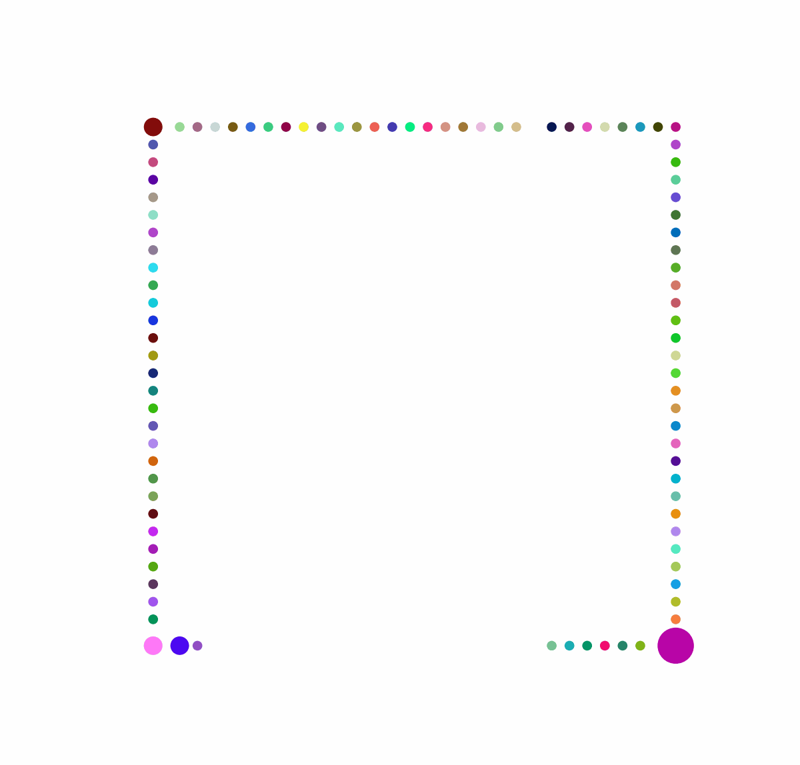

This is a repository with implementations of [priority inheritance backtracking](https://kei18.github.io/pibt2/) for large agents on a square grid (LaPIBT).

**Here is an example of algorithm solutions**

Hello! Solved by LaPIBT

 

    

  

## Project Structure:
The project has two realizations of code that follow a structure very similar to the original [PIBT](https://github.com/Kei18/pibt2) code. We also use the same third-party utilities.

**/circle-large-agents-mapf**

> You will find a realization of LaPIBT for objects that have circular shapes. The folder also contains an example of a solution in .gif format, examples of test cases, and instructions on how to build and run the code.

**/square-large-agents-mapf**

> You will find a realization of LaPIBT for objects that have square shapes. The folder also contains an example of a solution in .gif format, examples of test cases, and instructions on how to build and run the code.

**/third_party**

> This folder contains necessary third-party libraries in the form of _git-submodules_ for both square and circular realizations. It should not really be looked at, but it's important to pull/clone the repository with its submodules to populate this folder.
>
> e.g., `git pull --recurse-submodules` or `git clone --recurse-submodules`

**/solution-visualisation**

> This folder has utility code to visualize and create gifs out of solution files from both circular and square realizations of LaPIBT.
